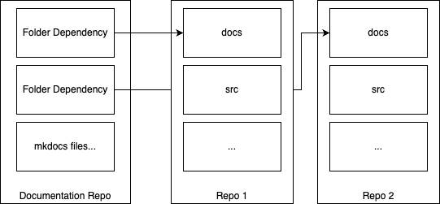
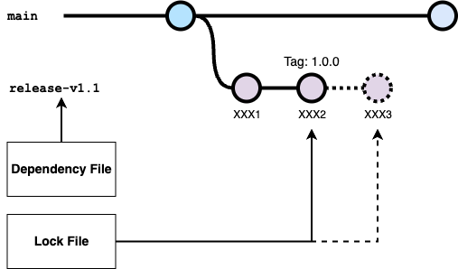

# Concept

There are many package managers for source code dependencies, that can be used to manage code-level dependencies.
However, there are no real options for folder-level dependencies, which are especially useful for documentation and other non-code assets.

This tool is a simple CLI that synchronizes a list of Git repositories to a local folder, and generates a lockfile containing the commit hash for each repository. Additionally, it supports syncing only a subdirectory of each repository, which allows for a single repository to contain both code and documentation, and only the documentation is synced to a collector-repo that actually builds and hosts the documentation.

It makes no assumptions about location or access permissions to the dependencies. As long as you can locally run `git clone` and `rsync`, you can use this tool.



## Updates with stable release branch

Our use-case includes a git repo with a stable release branch for each minor version. This describes the process of updating the lockfile to the latest stable release branch.

```
dependencies:
  - url: https://github.com/yourusername/repo1.git
    subdirectory: docs
    ref: release-v1.1
    target: docs/postgres
```



The lock file always shows the commit hash of the currently synced ref. When the tool is run, and a new commit hash is found on the remote, the lockfile is updated with the new commit hash and the target folder is synced.
