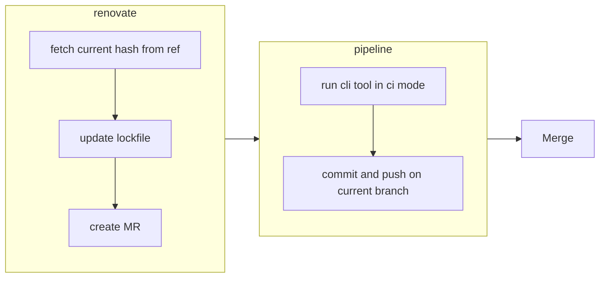
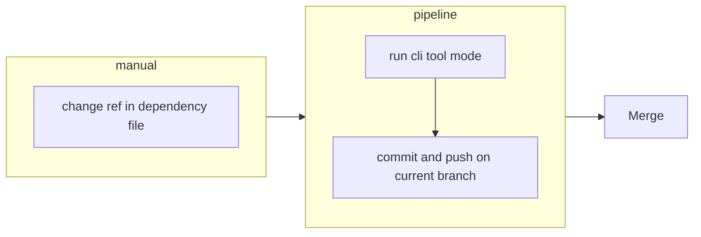

# Automated dependency updates with GitLab Pipelines

## Automatically with RenovateBot

The RenovateBot should be configured to update the lockfile when the upstream ref changes.  
The pipeline should be triggered on change of the lockfile and run in ci mode, which will sync the repos based on the lock file, and NOT self-update the pointer in the lock file.

## Manual update of dependency file

When the dependency file is updated manually, the pipeline should be triggered in normal mode, which will sync the repos based on the dependency file, and self-update the pointer in the lock file.

Therefore, any merge requests with changes to the dependency file will automatically include the changes in the dependencies.
